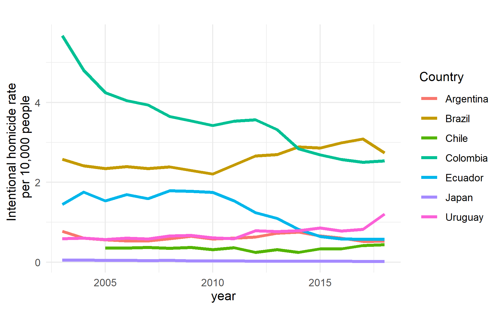
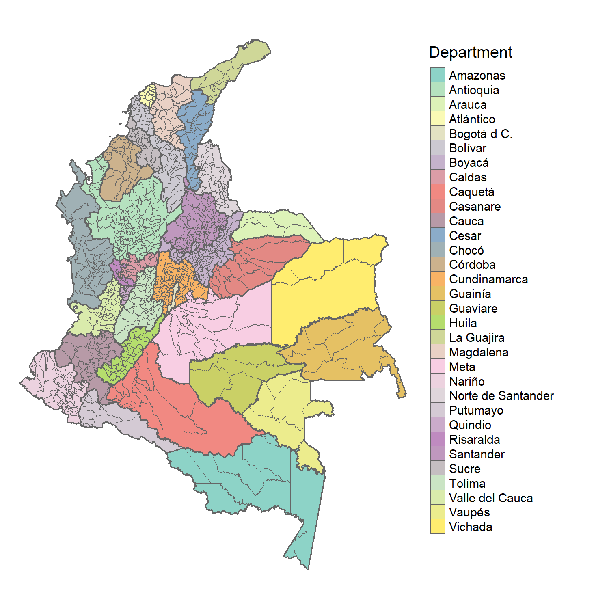
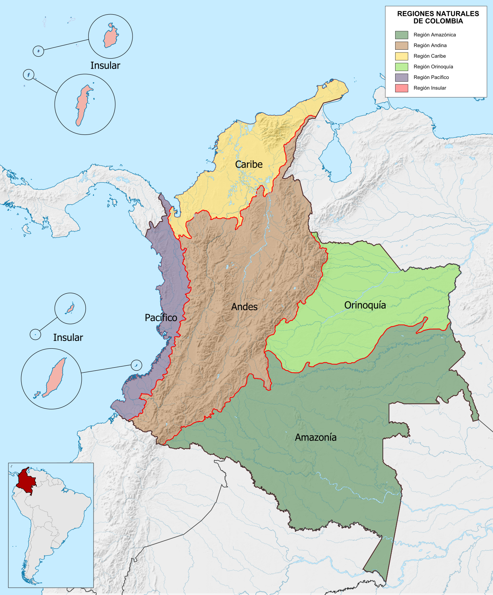
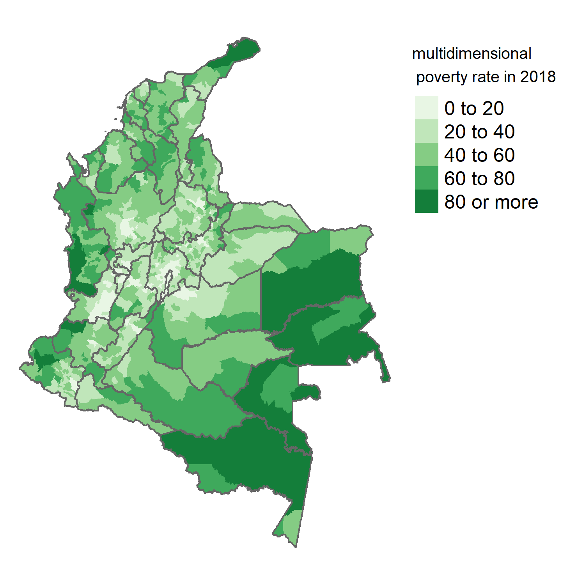
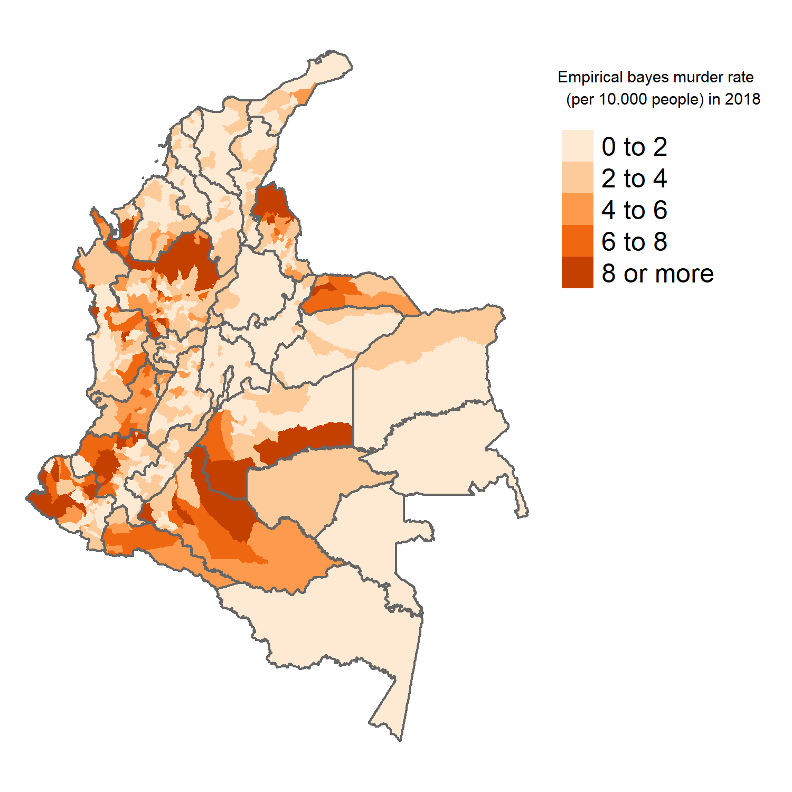
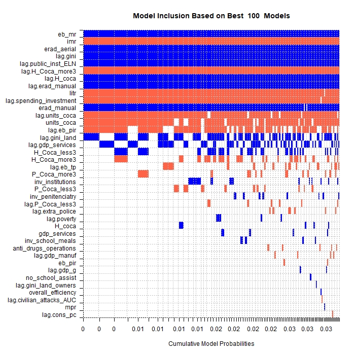
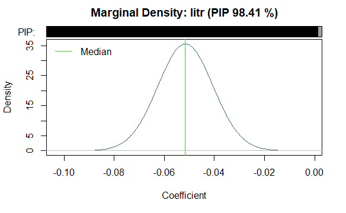
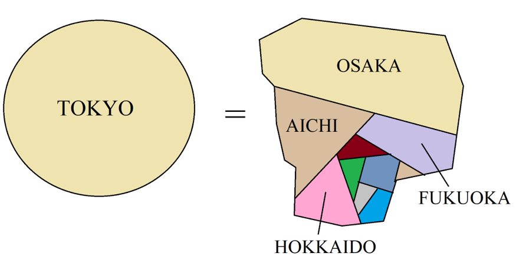

class: highlight-last-item
```{r setup, include=FALSE}
options(htmltools.dir.version = FALSE)
knitr::opts_chunk$set(echo = FALSE, warning = FALSE, message = FALSE)
knitr::opts_chunk$set(fig.showtext = TRUE)
library(tidyverse)
```

```{r xaringan-themer, include=FALSE, warning=FALSE}
library(xaringanthemer)
style_duo(
  primary_color = "#035AA6",        # blue = "#035AA6"
  secondary_color = "#161872",      # dark blue = "#161872" ; dark green =　"#00470e" ; orange = "#e87205"
  text_color = "#242629",
  link_color = "#00470e",   # orange = "#e87205"   dark green =　"#00470e"
  text_bold_color = "#035AA6",      # blue = "#035AA6"  dark green =　"#00470e"
  background_color = "#e1ebf4",
  inverse_background_color = "#e1ebf4",
  inverse_text_color = "#242629",
  title_slide_text_color = "#161872",   # dark blue = "#161872"
  title_slide_background_color = "#e1ebf4",
  header_font_google = google_font("Crete Round"),
  text_font_google   = google_font("Crete Round"),
  code_font_google   = google_font("Fira Mono"),
  header_h1_font_size = "2rem",
  header_h2_font_size = "1.20rem",
  header_h3_font_size = "1 rem",
  base_font_size = "20px"
)
```

```{css echo=FALSE}
.highlight-last-item > ul > li, 
.highlight-last-item > ol > li {
  opacity: 0.5;
}
.highlight-last-item > ul > li:last-of-type,
.highlight-last-item > ol > li:last-of-type {
  opacity: 1;
}
```


## Motivation:

- large regional inequality between Colombian municipalities and high homicide rates.
--

- There is no certainty over the effect of conditional transfers on violent crime, and especially on homicides. 
--

- Scarce academic literature on the impact of CCT programs on crime at the municipal level in Colombia.
--


## Research Objective:

- Which are determinants of homicide rates for Colombian municipalities?

- **To what extent the coverage of  conditional cash transfer program in Colombia (the pacific region of Colombia) may affect homicide rates?**. 

--

  
## Methods:

- Bayesian Model Averaging  **BMA** (Fernandez et al. (2001)).
--

- Synthetic control methods (Abadie and Gardeazabal (2003)).
--


## Data:

- Municipal panel dataset CEDE, released by the University of The Andes. 
--

- National Administrative Department of Statistics. 
--

---

class: middle, highlight-last-item

## Main Results:


-  15 variables are found to be important determinants of homicide levels. They are related to **crime, inequality, drug-trafficking, conflict and literacy**.

--

- The importance of spatial effects is highlighted by the fact that out of 15 variables **9 are spatially lagged variables**.

--

- It was reported that by 2018, **the average homicide rates were lower for high CCTs coverage municipalities** when compared to synthetic controls  ("copies" made out of a pool of low CCT coverage municipalities).


---
class: middle, highlight-last-item
## Homicide rates over time


Intentional homicides for selected South American countries and Japan (Source:
Author’s calculations using data from the WDI World Bank (2020))
---

.pull-left[ ## Colombian administrative levels 
## States and Municipalities


]

.pull-right[ ## Natural Regions


]


---
# Large regional disparities in Colombia

.pull-left[

### Well-being


]

.pull-right[
### Crime

**(In Germany = about 0.1 per 10.000 people)**
]

---

class: 

### Bayesian Model Averaging BMA - methods and results:

$$y=\alpha_{i}+X_{i} \beta_{i}+\varepsilon, \quad \varepsilon \sim N\left(0, \sigma^{2} I\right)$$ 
--

- **how can researchers select just a handful of determinants?** 
--

- **how to evaluate the importance of the inclusion of specific determinants in the model?**
--

- Bayesian Model Averaging (BMA) methods attempt to overcome these problems by estimating linear models for all (**MANY**) possible combinations of determinants $X_{i}$
--


.pull-left[ 
]
.pull-right[  
]

---

class: center

## **212 variables** between original and spatially lagged variables were tested as determinants of 2018 homicide rates. 

##**After running 2 million regressions...**

 
---
class: center, highlight-last-item


# Synthetic control methods

## visual intuition (In terms of GDP per capita)



--

$$TOKYO=0.4*OSAKA + 0.2*AICHI+0.1∗FUKUOKA+...$$
--

### In terms of crime

The weights are found so that the synthetic municipality has a similar crime trend compared to the treatment municipality (2003-2011) and similar determinants of crime.

---

class: center
##  Results: Synthetic control methods

.pull-left[ **$$high-CCT-coverage > 70\%$$**
]

.pull-right[ ** $$low-CCT-coverage < 30\%$$**
]

--


---
class:  center
# The effect of CCTs on crime
--

.pull-left[

**Crime gaps for treatment municipalities and control placebos**

]
--

.pull-right[
**Overall effects = the gap in 2018 / Root mean squared predicted error**


]
--

## A t-test shows that the mean effect (lower crime) is statistically lower for the treatment group.

--
The results of the synthetic controls methods are fully reproducible. 
https://github.com/quarcs-lab/Tutorial-synthetic-control-methods-Felipe-thesis-chapter5  

---
class: highlight-last-item

### Concluding Remarks

- Supporting previous studies, variables related to **inequality, literacy rates, previous crime levels, institutional capabilities, conflict and drug-trafficking**  were reported as significant determinants of homicide rates.
--

- By 2018, **the average homicide rates were lower for high CCT coverage municipalities** when compared to synthetic copies made out of a pool of low CCT coverage municipalities.
--


### Implications

- CCT programs appear to be comprehensive policies as thez can tackle multiple issues such as **poverty, low education outcomes and violence**.
--

- Given funding constraints, it seems that investing in the expansion of this policy in the Pacific region can be an effective ways to improve developmental outcomes in several areas.
--

- The framework of this paper can be considered a **data science framework to test the impact of regional policies**

$$BMA \rightarrow  \space determinants \space  of\space Y \rightarrow  Synethetic \space Controls \rightarrow The \space impact \space of \space  X \space on \space Y  $$


---
class: middle, highlight-last-item

### Further research

- The robustness of the result can be tested by changing the thresholds for low and high CCT coverage.  Instead of 30%  and 70%, one can use thresholds such as **20%-80% and 25%-75%**.
--


- A dataset of determinants of crime based on previous literature (instead of the determinants found with the BMA) can be assembled.  **This new dataset can be used as the input for the synthetic control analysis.**
--

- **How can we integrate spatial effects and Synthetic Controls?**
Spatial filtering? 
Adding a distance indicator as one of the determinants in the Synthetic Controls framework?

---


class: center, middle

# Thank you very much for your attention
personal website: https://felipe-santos.rbind.io

slides available at:  https://ersa-felipe-santos.netlify.app

.pull-left[


**Quantitative Regional and Computational Science lab**

https://quarcs-lab.org

]

.pull-right[


**Chair of International Economics
Technische Universität Dresden
Germany**

https://tu-dresden.de/bu/wirtschaft/vwl/iwb 
]


